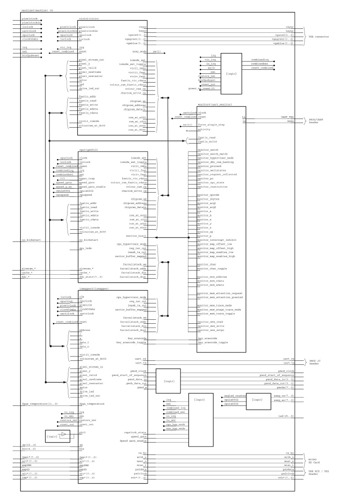
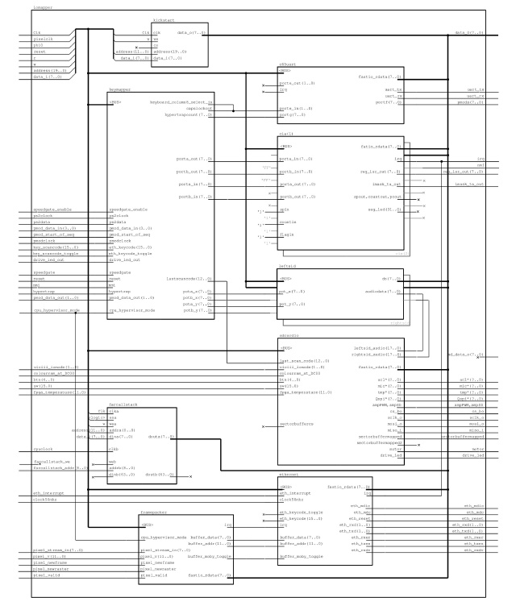

## This is the **structural** documentation file.

# Table of Contents:

[Introduction](#introduction)

The following components are currently documented (at least in part):

* [container](#container)
* [container/ddrwrapper](#ddrwrapper) - **now removed**
* [container/machine](#machine)
* [container/machine/iomapper](#iomapper)
* [container/machine/iomapper/kickstart](#kickstart)
* [container/machine/iomapper/farcallstack](#farcallstack)

## Introduction

This page will give an overview of *some* of the components, especially the components at the upper levels. For lower-level components, it is recommended that state-machine diagrams or data-flow diagrams$

Contributors: please order the components within this file as they appear in Xilinx ISE.

## container
the toplevel component within the fpga design.  
  
Click the image above for a hi-res JPG, else the [PDF link](./images/machine.pdf).  
**NOTE that the DDRcontroller/DDRwrapper component needs to be removed from image**

ie: 48MHz clock comes in, is buffered and fed to a CLKDLL  
ie: the CLKDLL outputs four clock signals that are used within the design  
ie: clk_out0 - designed to be 48MHz  
ie: clk_out1 - designed to be 24MHz  

The [machine](#machine) component holds the significant rest of the architecture.

Other 'logic' includes signal routing, input debouncing, etc.

## ddrwrapper
This component has temporarily been removed. Need to update image.

## machine
This component holds most of the fpga design, including CPU, Memory, VIC/SID chips etc.  

Sub-components include:  
* "viciv" (to be do)  
* "gs4510" (to be do)  
* "[iomapper](#iomapper)"  
* "uart_monitor" (to be do)  

As shown in the diagram below, the "machine" component holds the four sub-components listed above.
In addition, the "machine" component includes:
* a process to generate interrupt/reset,  
* a process for reset-logic, LEDs, 7-seg display,  
* a process to generate "phi0",  
* a process to manipulate "pmod" header.  

  
Click the image above for a hi-res JPG, else the [PDF link](./images/machine.pdf).

## iomapper
This components includes the following functionality:  
* implements the "SID"/sound chip(s) of the Commodore 64,
* implements the "CIA"/timer chip(s) of the Commodore 64,
* provides multiple external interfaces: keyboard, uart, SDcard, ethernet, etc.

Sub-components include:  
* "[kickstart](#kickstart)"  
* "keymapper" (to be do)  
* "c65uart" (to be do)  
* "cia" (to be do)  
* "sid" (to be do)  
* "sdcardio" (to be do)  
* "[farcallstack](#farcallstack)"  
* "framepacker" (to be do)  
* "ethernet" (to be do)  

  
Click the image above for a hi-res JPG, else the [PDF link](./images/iomapper.pdf).

## kickstart
This component is basically just a ROM, and is just implemented using processes, ie no sub-components.

## farcallstack
This component seems to be a dualport RAM, and is just implemented using processes, ie no sub-components.

The End.
